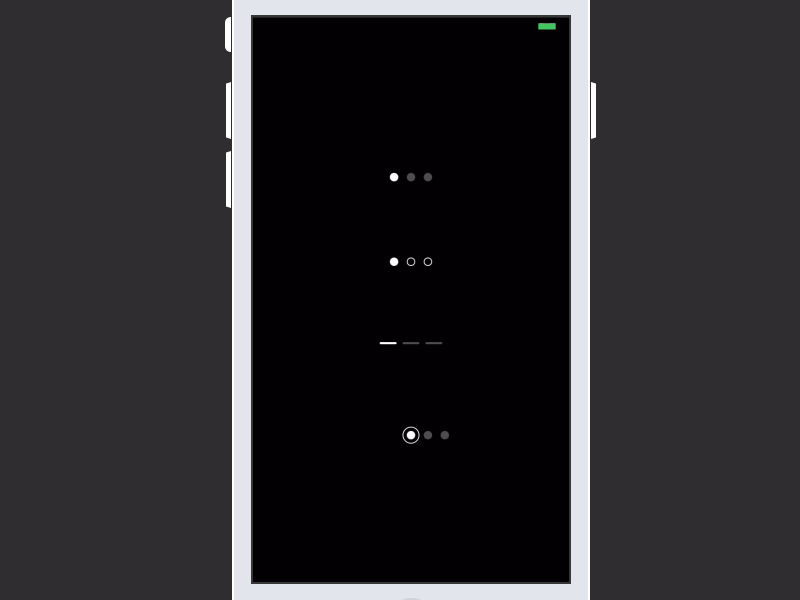

# PageControls

 

## Description

Swift Package 📦 This is a selection of custom page controls to replace `UIPageControl`, inspired by a dribbble found [here]( https://dribbble.com/shots/2578447-Page-Control-Indicator-Transitions-Collection). The appearance (color, size, # of pages) of each control can be customized using Interface Builder.

## Installation

Use `Swift Package Manager` to install.

## Author

Kyle Zaragoza, popwarsweet@gmail.com
Twitter: [@KyleZaragoza](https://twitter.com/kylezaragoza). Refactored and adapted for use with the `Swift Package Manager` by [Vitalis Gkirsas](https://github.com/epitonium).

## License

`PageControls` is distributed under the terms and conditions of the [MIT license](https://github.com/SVProgressHUD/SVProgressHUD/blob/master/LICENSE).
